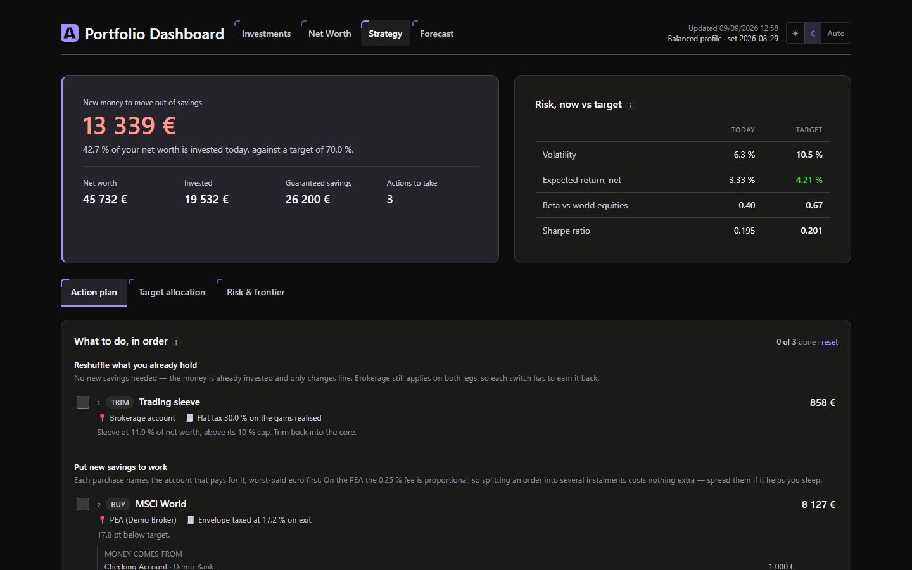
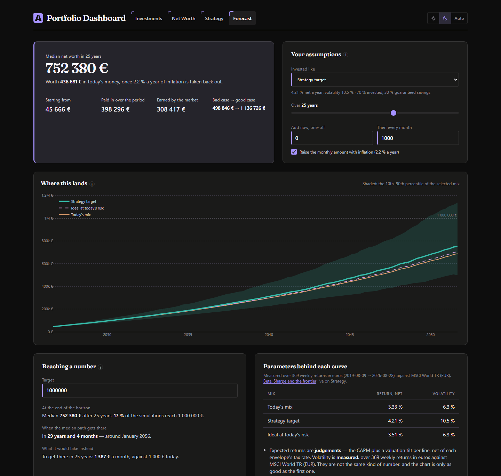
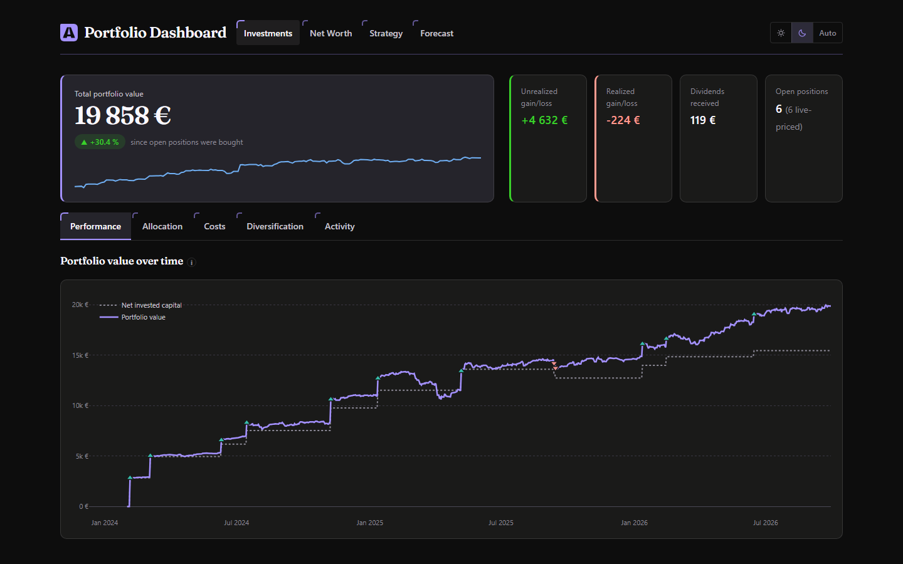
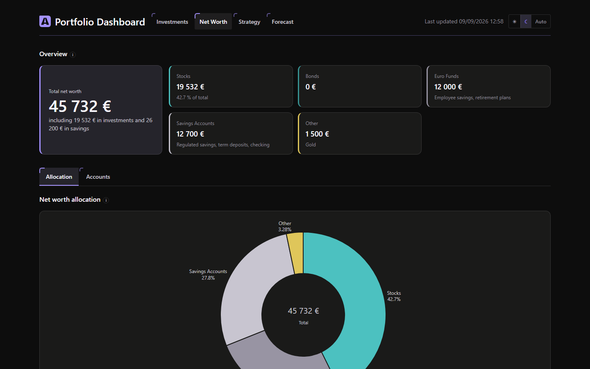
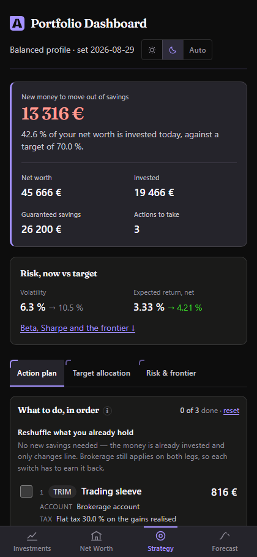
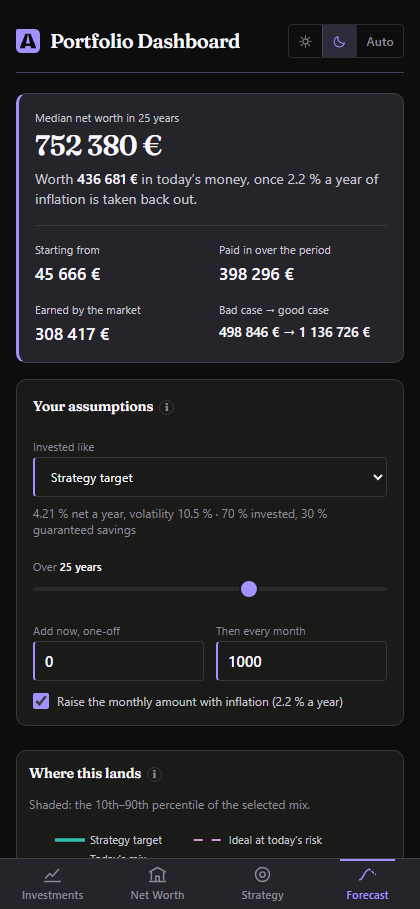
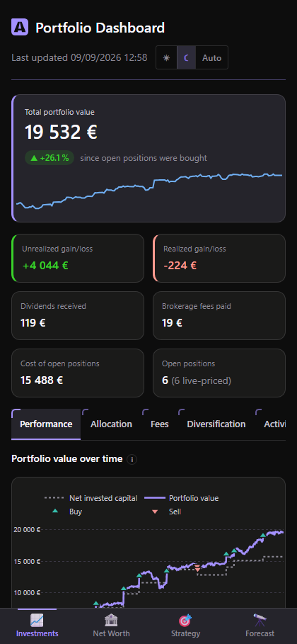

# 📊 Portfolio Dashboard

A stock portfolio analysis dashboard built from broker CSV exports (Fortuneo,
Trade Republic). Rebuilds positions and PnL from the raw transaction journal
(no broker API), computes dividends, management fees, geographic/sector
diversification, and compares total net worth (investments + savings) against
a target allocation.

**[➡ Live demo](https://portfolio-dashboard-demo.onrender.com)**
*(100% fictional data — see [Privacy](#privacy) below. The free-tier service
sleeps after 15 min of inactivity: the first load can take ~30s.)*

## Screenshots

**Strategy** — the target allocation turned into an ordered, priced, funded action plan.



**Forecast** — the median path with its 10th–90th percentile band, a dashed
benchmark showing the best mix available *at the risk already being run*, and a
goal calculator that answers in probabilities rather than with one confident
number.



| Investments | Net worth |
| --- | --- |
|  |  |

Built mobile-first, and installable as a PWA:

<p>
  
  
  
</p>

*Shown in dark mode; the app follows the system theme and keeps a manual toggle.
Every figure above comes from the fictional demo dataset, not from a real
portfolio — `scripts/generate_screenshots.py` regenerates these images and
refuses to run against anything but `demo/`.*

The stylesheet is compiled, not fetched: `dashboard/static/app.css` is built
from the templates by `python scripts/build_css.py` (needs Node for `npx`, and
only to rebuild — never at runtime). Run it after adding a utility class to a
template, or the class will silently do nothing.

## Features

- **Position reconstruction** at weighted average cost from the raw journal
  (buys/sells/dividends), with no dependency on a broker API.
- **Live prices** via [yfinance](https://pypi.org/project/yfinance/) for
  mapped assets (`config/tickers.json`), with an explicit fallback to average
  purchase price for the rest — never an invented price.
- **Investments view**: performance over time, asset ranking, allocation by
  broker, geographic/sector diversification, annual management fees,
  transaction/dividend activity log.
- **Net Worth view**: investments + savings accounts (regulated savings,
  retirement plans, life insurance...), comparison against a target allocation
  with gaps highlighted.
- **Strategy view**: a strategic allocation you define once, and everything that
  follows from it — drift against target, envelope capacity (including the PEA
  contribution ceiling), a trading sleeve capped at a share of net worth, and an
  **ordered action plan**: what to buy, in which envelope, which fund (with its
  ISIN, ongoing charge and size), funded from which account, each order priced at
  the broker's real fee and checked against what the switch actually earns back.
  Backed by measured risk figures: volatility, beta, correlations, efficient
  frontier, stress scenarios.
- **Forecast view**: today's net worth carried forward, as the *median* of
  1 000 simulated histories with a 10th–90th percentile band around it — never a
  single confident-looking curve. Reference lines for the mix you hold today, the
  mix your strategy targets, and a dashed **ideal**: the tangency portfolio
  blended with guaranteed savings down to the volatility you *already* run, so
  the gap between the two is what the construction earns rather than what extra
  risk earns. Plus a goal calculator read in three directions from that same
  simulation — what you end up with, when the median path crosses your target,
  and the monthly effort that would get you there inside a given horizon —
  together with the odds of actually making it.
- **Installable PWA** on a phone (home-screen icon, full screen), built
  mobile-first (tap-friendly lists, compact charts, tab navigation).

## Architecture

```
portfolio-dashboard/
├── data/                    # REAL data — never committed (.gitignore)
│   ├── fortuneo/             # Fortuneo "transaction history" exports
│   ├── trade_republic/       # Trade Republic "transactions_*.csv" exports
│   ├── accounts/accounts.json  # Savings accounts, entered by hand
│   └── processed/            # Normalized transactions.csv (generated)
├── config/                  # Personal mappings — never committed (.gitignore)
│   ├── tickers.json          # asset_key -> Yahoo Finance ticker
│   ├── fees.json              # asset_key -> annual TER (%)
│   ├── asset_classes.json     # asset_key -> asset class
│   ├── target_allocation.json # target net worth allocation (%) — fallback only
│   ├── exposure.json          # asset_key -> country/sector breakdown
│   ├── strategy.json          # strategic allocation POLICY (hand-edited)
│   └── strategy_analytics.json # risk figures (generated, never hand-edited)
├── demo/                    # 100% FICTIONAL equivalent of data/ + config/,
│   │                          committed for the public demo
│   └── ...                   # same layout as data/ and config/
├── docs/screenshots/        # Images used by this README
├── scripts/
│   ├── generate_demo_data.py # (Re)generates demo/ from scratch
│   ├── generate_icons.py     # (Re)generates the PWA icon set from the monogram
│   ├── generate_screenshots.py # (Re)generates docs/screenshots/ (demo only, dark)
│   ├── review_shots.py      # Sweeps every view/tab/breakpoint, diffs two sweeps
│   ├── chart_metrics.py     # Reports plot area vs margin per figure, per width
│   ├── build_css.py         # (Re)builds dashboard/static/app.css from templates
│   └── build_strategy.py     # Computes strategy_analytics.json (needs scipy)
├── importers/
│   ├── fortuneo.py            # Fortuneo parser (CSV ';', cp1252)
│   ├── trade_republic.py      # Trade Republic parser (CSV ',', UTF-8)
│   ├── corrections.py         # Manual corrective buys (incomplete history)
│   └── normalize.py           # Merges every source into one common journal
├── analytics/
│   ├── strategy.py            # Target vs actual, envelopes, action plan, funding
│   ├── positions.py           # Weighted average cost + realized PnL
│   ├── kpis.py                 # Global KPI aggregation
│   ├── performance.py          # Portfolio value over time
│   ├── performance_by_asset.py # Per-asset performance
│   ├── patrimoine.py           # Net worth view (investments + savings)
│   ├── projection.py           # Forecast scenarios (mix -> expected return + volatility)
│   └── exposure.py             # Geographic/sector diversification
├── market_data.py            # Live prices via yfinance (+ disk cache)
├── paths.py                  # data/config resolution, override via PORTFOLIO_ROOT
├── dashboard/
│   ├── app.py                  # Flask server + Plotly chart generation
│   ├── palette.py              # The one colour source, shared by the CSS and the figures
│   └── templates/               # base.html, index.html (Investments), net_worth.html,
│                                #   strategy.html, forecast.html
├── wsgi.py                    # gunicorn entry point (deployment)
├── main.py                    # CSV import + command-line summary
├── Procfile / render.yaml     # Render deployment
└── requirements.txt
```

## Setup (with your own data)

```bash
pip install -r requirements.txt
```

1. Drop your CSV exports into `data/fortuneo/` and `data/trade_republic/`
   (multiple files per folder are supported, deduplicated automatically).
2. Fill in `data/accounts/accounts.json` with your savings accounts (see
   `analytics/patrimoine.py` for the expected schema).
3. (Optional but recommended) Fill in `config/tickers.json` with the Yahoo
   Finance ticker of every asset you hold, to get live prices instead of the
   average purchase price. Check each ticker on
   [finance.yahoo.com](https://finance.yahoo.com) before entering it — a wrong
   ticker would skew the valuation.
4. Fill in `config/asset_classes.json`, `config/fees.json`,
   `config/target_allocation.json`, and `config/exposure.json` using the same keys.
5. Run the command-line summary:
   ```bash
   python main.py
   ```
6. (Optional) Define a strategic allocation in `config/strategy.json` — target
   weights per line, tolerance bands, envelopes and their ceilings, the ordered
   list of accounts to fund purchases from, and the trading sleeve's cap. Then
   compute the risk figures behind it:
   ```bash
   pip install -r requirements-strategy.txt   # adds scipy, for this script only
   python scripts/build_strategy.py
   ```
   The Strategy page works without this step; only its "Risk & frontier" tab
   needs it.
7. Start the dashboard:
   ```bash
   python dashboard/app.py
   ```
   Then open **http://localhost:5050** (also reachable from the same Wi-Fi
   via the IP printed at startup — handy for testing on a phone).

## Demo mode (no personal data)

The app can run entirely on a fictional dataset, via the `PORTFOLIO_ROOT`
environment variable, which redirects `data/` and `config/` to another
directory with the same layout:

```bash
# Windows PowerShell
$env:PORTFOLIO_ROOT = "demo"; python dashboard/app.py
# macOS / Linux
PORTFOLIO_ROOT=demo python dashboard/app.py
```

The contents of `demo/` are generated by `scripts/generate_demo_data.py` — a
fully invented portfolio and set of accounts, built on real, publicly traded
tickers (Apple, LVMH, Sanofi, Coca-Cola, world-equity ETFs) so live prices stay
credible. This is the folder that powers the public deployment.

## Deployment (Render)

The repo includes a ready-to-use `render.yaml`:

1. Create a [Render](https://render.com) account and connect the GitHub repo.
2. **New +** → **Blueprint**, select this repo — Render reads `render.yaml`
   and configures the service automatically (`gunicorn wsgi:app`,
   `PORTFOLIO_ROOT=demo`).
3. Deploy. The free plan sleeps after 15 min of inactivity (slower first load
   after a pause).

The Flask dev server (`python dashboard/app.py`) is **not** used in
production — `wsgi.py` + `gunicorn` handle that.

## Supported CSV formats

### Fortuneo — "Historique des opérations bourse"
CSV `;`-separated, Windows-1252 encoding, columns: `libellé;Opération;Place;Date;Qté;Prix
d'éxé;Montant brut;Courtage/Prélèvement;Montant net;Devise`. (Column names are
in French because they mirror Fortuneo's own real export format.)

### Trade Republic — "Transactions" export
CSV `,`-separated with quotes, UTF-8, columns: `datetime,date,account_type,category,
type,asset_class,name,symbol,shares,price,amount,fee,tax,currency,...`. The
`symbol` field actually holds the ISIN.

## Calculation notes

- **Weighted average cost**: every buy increases the quantity and total cost
  held; every sell removes the sold quantity at the current average cost and
  triggers the corresponding realized PnL.
- **Fortuneo dividends**: only rows labeled `Encaissement coupons
  intérêt/dividende` count as a real dividend. Rows labeled `OST de création de
  coupons` / `ANNUL. OST...` (technical bookkeeping entries tied to optional
  coupon detachment) are kept in the journal but excluded from the totals,
  since their exact accounting treatment isn't certain — worth double-checking
  against the Fortuneo statement if cent-level precision is needed.
- **Net invested capital** (performance chart) = net cash flow into
  investments (purchases − sale proceeds), not the strict accounting cost
  basis of open positions.
- **Strategy — what is measured vs decided**: volatility, beta, correlations and
  covariances are *measured* from weekly returns in euros over the window set in
  `config/strategy.json`. Expected returns are *judgements*: the CAPM
  (`risk-free + beta x equity risk premium`) plus an explicit valuation tilt per
  line, then net of each envelope's tax rate. The two are deliberately shown side
  by side with past returns, which they are not meant to match. A line too recent
  to carry a statistic borrows a long-history proxy, declared and justified in the
  config; the app labels every proxied line. `build_strategy.py` never rewrites
  the targets — a strategic allocation that silently drifts with the market is not
  a strategy.
- **Forecast — why the median, not the average**: `expected_net_pct` is an
  *arithmetic* expected return. Compounding it directly would draw the **mean**
  path and pass it off as the typical one: at 15.6 % volatility that is 1.2
  points a year of phantom drift, roughly a quarter of the final amount over
  twenty years. Each mix is therefore simulated as a lognormal matched to its
  (µ, σ) — `s² = ln(1 + σ²/(1+µ)²)`, `m = ln(1+µ) − s²/2` — so the central line
  is the median and the mean still comes out at `(1+µ)^t`. All the mixes are run
  through the *same* 1 000 simulated markets, so the distance between two curves
  is the difference between the mixes and not Monte Carlo noise. The whole
  simulation runs in the browser: it has to answer while a slider is moving, and
  a server round-trip would refetch prices on every drag.
- **Forecast — the "ideal" line**: the tangency portfolio blended with the
  risk-free rate down to the volatility the portfolio already runs (the capital
  market line, the same dashed line the efficient-frontier chart draws). Pinning
  it to today's risk is deliberate: benchmarking against the raw tangency
  portfolio would mostly measure the extra risk it takes. It is an in-sample
  optimum over one window, so it is a benchmark, not a promise — and the page
  says so. Contributions are assumed invested at the chosen mix, and envelope
  ceilings (the PEA cap in particular) are *not* modelled there; the Strategy
  page is the one that tracks them.
- **Historical prices**: for assets without a mapped ticker, the price history
  is approximated by the current average purchase price (a flat line) — the
  performance curve is therefore only reliable for assets mapped in
  `config/tickers.json`.

## Privacy

No personal data is ever sent anywhere or committed to Git:

- `data/fortuneo/*.csv`, `data/trade_republic/*.csv`, `data/processed/*.csv`,
  `data/accounts/`, `data/corrections/*.csv`, and every file under
  `config/*.json` (tickers, fees, asset classes, target allocation, exposure,
  strategy and its analytics — they reveal the exact composition of the real
  portfolio) are excluded via `.gitignore`.
- The public demo runs exclusively on `demo/`, a fictional dataset committed
  on purpose (see [Demo mode](#demo-mode-no-personal-data)).
- All computation runs locally (or on the deployment instance you control);
  the only outbound network call is to Yahoo Finance for prices.
